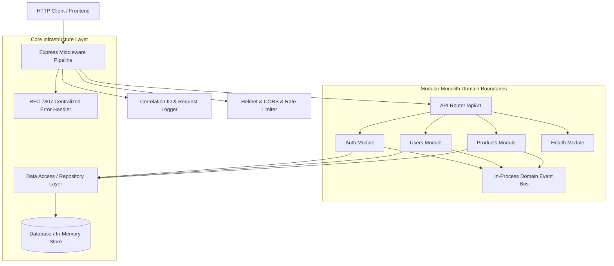

# Enterprise Monolithic Architecture Document

## 1. Architectural Overview

This system is engineered as a **Production-Grade Modular Monolith** in pure JavaScript (ES2022 ESM) running natively on Node.js 18+. It balances developer velocity, deployment simplicity, and strict domain boundaries—allowing individual modules to be decoupled and, if desired in the future, extracted into independent microservices with minimal refactoring.



---

## 2. Core Architectural Principles

### 2.1 Separation of Concerns & Layered Architecture
Each domain module adheres to a strict 4-layer architecture:
1. **Routing Layer (`*.routes.js`)**: Defines endpoint routes, binds HTTP verbs, attaches authentication/authorization guards, and binds request validation schemas.
2. **Controller Layer (`*.controller.js`)**: Decoupled from transport specifics. Validates HTTP input, delegates to services, and packages JSON responses using the standard `ResponseUtil` envelope.
3. **Service Layer (`*.service.js`)**: Encapsulates pure business logic, domain invariants, password hashing, token rotation, and dispatches domain events. Completely agnostic of Express `req`/`res`.
4. **Data Access / Repository Layer (`*.repository.js`)**: Abstracts persistence mechanisms. Follows the Data Mapper / Repository pattern, allowing seamless substitution between in-memory collections and persistent SQL/NoSQL databases (e.g. Prisma / PostgreSQL).

### 2.2 Loose Coupling via In-Process Domain Event Bus
Modules communicate cross-boundary asynchronously via an internal Event Bus (`EventBus`). For example:
- `AuthService` emits `user.registered`.
- Subscribing modules (such as notification services, welcome email dispatchers, or audit logging) handle this event independently without circular dependencies between modules.

### 2.3 RFC 7807 Standardized Problem Details
All error responses strictly adhere to [RFC 7807 (Problem Details for HTTP APIs)](https://datatracker.ietf.org/doc/html/rfc7807):
```json
{
  "type": "https://errors.api.enterprise.com/validation-error",
  "title": "Validation Error",
  "status": 422,
  "detail": "Request validation failed",
  "instance": "/api/v1/auth/register",
  "code": "VALIDATION_ERROR",
  "timestamp": "2026-09-07T14:55:00.000Z",
  "errors": [
    {
      "field": "password",
      "message": "Password must contain at least one special symbol"
    }
  ]
}
```

---

## 3. Security Hardening & OWASP Compliance

1. **Helmet**: Sets secure HTTP response headers (`X-Content-Type-Options`, `Strict-Transport-Security`, `X-Frame-Options`, `Content-Security-Policy`).
2. **CORS**: Enforces origin whitelisting configured through environment variables.
3. **Rate Limiting**: Defends against brute-force password guessing and Denial of Service (DoS) attacks.
4. **Cryptographic Hashing**: Passwords hashed using bcrypt with an adaptive work factor (12 salt rounds).
5. **Token Security**: Stateless JWTs using HMAC-SHA256 with strong minimum-32-character secrets. Access tokens are short-lived (`1h`) and refresh tokens are strictly rotated and revokable.
6. **Input Sanitization & Schema Validation**: Strict input boundary validation via Zod; unrecognized payload fields are sanitized, prevented, or ignored.
7. **Production Error Masking**: Stack traces and raw internal error messages are suppressed in production mode to prevent information leakage.
